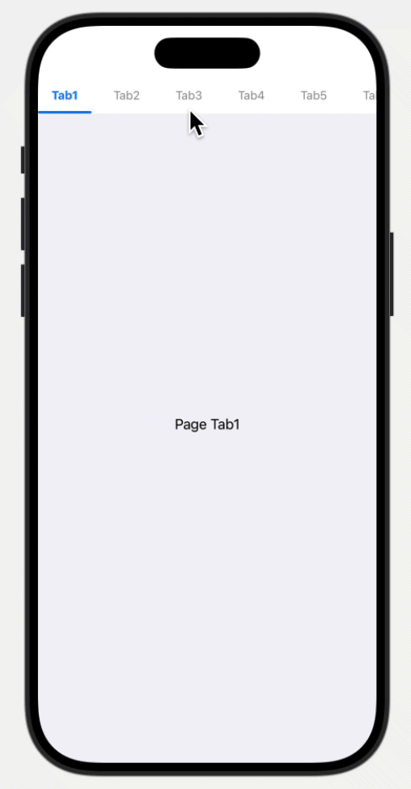

# SwiftUITabView

`SwiftUITabView` は SwiftUI で使用可能なモディファイアです。
このモディファイアを使用すると、画面上部にタブバーを表示することができます。



## 対応バージョン

- iOS 17.0+

## 機能

- タブバーの表示

## インストール

SwiftUITabView を Swift Package Manager を使用してインストールするには、`Package.swift` ファイルに以下を追加します。

```swift
dependencies: [
    .package(url: "https://github.com/sakes9/SwiftUITabView.git", .branch("main"))
]
```

次に、`SwiftUITabView` をターゲットの依存関係として追加します。

```swift
.target(
    name: "YourTargetName",
    dependencies: ["SwiftUITabView"]
)
```

## 使い方

SwiftUITabView を使用するには、`TabBarView（SwiftUITabView）` と `TabView` を組み合わせて使用します。
`TabView` は `TabBarView` で選択されたタブに応じて表示するコンテンツを管理します。

```swift
import SwiftUI
import SwiftUITabView

struct ContentView: View {
    @State private var selectedIndex: Int = 0
    private let tabs = (1 ... 10).map { "Tab\($0)" }

    var body: some View {
        VStack(spacing: 0) {
            TabBarView(selectedIndex: $selectedIndex,
                       titles: tabs,
                       selectedColor: .blue)
            TabView(selection: $selectedIndex) {
                ForEach(tabs.indices, id: \.self) { index in
                    Text("Page \(tabs[index])").tag(index)
                }
            }
            .tabViewStyle(PageTabViewStyle(indexDisplayMode: .never))
            .background(Color(.systemGray6))
        }
    }
}
```

### パラメーター

| パラメーター | 型 | 説明 | デフォルト
| --- | --- | --- | ---
| `selectedIndex` | `Int` | 選択されたタブのインデックス | -
| `titles` | `[String]` | タブのタイトル | -
| `selectedColor` | `Color` | 選択されたタブの色 | `.gray`